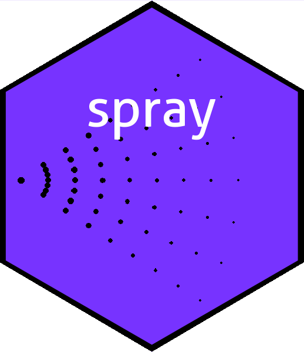

The spray package: sparse arrays in R
================

<!-- README.md is generated from README.Rmd. Please edit that file -->

# spray 

<!-- badges: start -->

[](https://cran.r-project.org/package=spray)
[](https://app.codecov.io/gh/RobinHankin/spray/branch/master)
[](https://github.com/RobinHankin/spray/actions/workflows/R-CMD-check.yaml)
<!-- badges: end -->

# Overview

The `spray` package provides functionality for sparse arrays.  
In a sparse arrays, nonzero elements are stored along with an index
vector describing their coordinates. The `spray` package provides
functionality for sparse arrays and interprets them as multivariate
polynomials.

# Installation

You can install the released version of `spray` from
[CRAN](https://CRAN.R-project.org) with:

``` r
# install.packages("spray")  # uncomment this to install the package
library("spray")
```

# The `spray` package in use

Base R has extensive support for multidimensional arrays. Consider

``` r
a <- array(0,dim=4:12)
a[2,2,2,2,2,2,2,2,2] <- 17
a[3,4,2,2,7,2,3,2,3] <- 18
```

Handling `a` requires storage of

floating point numbers (of which two are nonzero), represented in an
elegant format amenable to extraction and replacement. Arrays such as
this in which many of the elements are zero are common and in this case
storing only the nonzero elements and their positions would be a more
compact and efficient representation. To create a sparse array object in
the `spray` package, one specifies a matrix of indices with each row
corresponding to the position of a nonzero element, and a numeric vector
of values:

``` r
library("spray")
M <- rbind(
  c(2,2,2,2,2,2,2,2,2),
  c(3,4,2,2,7,2,3,2,3))

S1 <- spray(M,7:8)
S1
#>                        val
#>  3 4 2 2 7 2 3 2 3  =    8
#>  2 2 2 2 2 2 2 2 2  =    7
```

Note that object `S1` is rather compact by comparison with plain array
`a`, as it needs to record only a 18-element index array of integers and
two double-precision entries. The order in which the elements are stored
is implementation-specific (see the vignette for details and an extended
discussion).

Basic arithmetic is implemented where appropriate. If we define

``` r
S2 <-spray(rbind(
  c(1,2,3,1,3,3,1,4,1),
  c(3,4,2,2,7,2,3,2,3)), c(100,-8))
S2
#>                        val
#>  3 4 2 2 7 2 3 2 3  =   -8
#>  1 2 3 1 3 3 1 4 1  =  100
```

then

``` r
S1+S2
#>                        val
#>  2 2 2 2 2 2 2 2 2  =    7
#>  1 2 3 1 3 3 1 4 1  =  100
```

(the entry with value `8` has cancelled out).

# The spray package and multivariate polynomials

One natural application for `spray` objects is multivariate polynomials.
Defining

``` r
S1 <- spray(matrix(c(0,0,0,1,0,0,1,1,1,2,0,3),ncol=3),1:4)
S2 <- spray(matrix(c(6,-7,8,0,0,2,1,1,3),byrow=TRUE,ncol=3),c(17,11,-4))
S1
#>            val
#>  1 1 3  =    4
#>  0 0 2  =    2
#>  0 1 0  =    3
#>  0 0 1  =    1
S2
#>             val
#>  1  1 3  =   -4
#>  0  0 2  =   11
#>  6 -7 8  =   17
```

it is natural to interpret the rows of the index matrix as powers of
different variables of a multivariate polynomial, and the values as
being the coefficients. This is realised in the package using the
`polyform` print option, which if set to `TRUE`, modifies the print
method:

``` r
options(polyform = TRUE)
S1
#> +4*x*y*z^3 +2*z^2 +3*y +z
S2
#> -4*x*y*z^3 +11*z^2 +17*x^6*y^-7*z^8
```

(only the print method has changed; the objects themselves are
unaltered). The print method interprets, by default, the three columns
as variables

although this behaviour is user-definable. With this interpretation,
multiplication and addition have natural definitions as multivariate
polynomial multiplication and addition:

``` r
S1+S2
#> +13*z^2 +3*y +z +17*x^6*y^-7*z^8
S1*S2
#> +17*x^6*y^-7*z^9 +11*z^3 +51*x^6*y^-6*z^8 +34*x^6*y^-7*z^10 -4*x*y*z^4
#> +33*y*z^2 -12*x*y^2*z^3 +22*z^4 +36*x*y*z^5 +68*x^7*y^-6*z^11
#> -16*x^2*y^2*z^6
S1^2+4*S2
#> +8*x*y*z^4 +9*y^2 +68*x^6*y^-7*z^8 +24*x*y^2*z^3 -16*x*y*z^3
#> +16*x*y*z^5 +45*z^2 +16*x^2*y^2*z^6 +4*z^3 +12*y*z^2 +4*z^4 +6*y*z
```

It is possible to introduce an element of symbolic calculation,
exhibiting familiar algebraic identities. Consider the `lone()`
function, which creates a sparse array whose multivariate polynomial
interpretation is a single variable:

``` r
x <- lone(1, 3)
y <- lone(2, 3)
z <- lone(3, 3)
(x + y) * (y + z) * (x + z) - (x + y + z) * (x*y + x*z + y*z)
#> -x*y*z
```

thus illustrating the identity
(xy+xz+yz)=(x+y)(y+z)(x+z)+xyz").

Spray objects can be coerced to functions:

``` r
S4 <- spray(cbind(1:3, 3:1), 1:3)
f <- as.function(S4)
f(c(1, 2))
#>  X 
#> 22
```

Differentiation is also straightforward. Suppose we wish to calculate
the multivariate polynomial corresponding to

^3.")

This would be

``` r
aderiv((xyz(3) + linear(1:3))^3, 1:3)
#> +216*x +108*x^2*y
```

The package vignette offers a detailed discussion of the package design
philosophy; also, the `mvp` package provides a further interpretation of
the concept of “sparse” in the context of multivariate polynomials.
